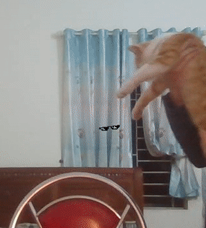

# Real-time cat decoration
This model is based on landmark detection with ResNet18 backbone.

# Run
1. Install the required packages
   ```
   pip install requirements.txt
   ```
2. Run real-time decorating with command
   ```
   python decorate.py 
                    --source <0 for webcam, string for video path>
                    --save_path <path to save the output video, default is ./output.mp4>
                    --show_size <output video size, default is 640x480>
   ```

# Demo


# Coming soon
1. Improve the performance
2. Import model accuracy
3. Mode decorate options